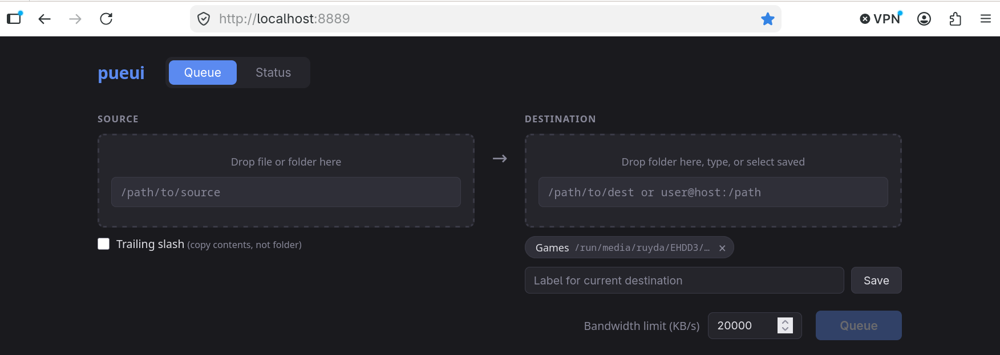
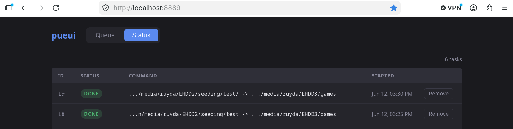

### pueui-rsync
A simple Node.js GUI for executing and monitoring pueue-powered `rsync` operations.

I use this to automate syncs between my slow hard drives.

pueue UI → pueui

Drag and drop source files and directories. Save your frequent destinations.


Watch your queue in realtime.


### Dependencies
- **pueue:** https://github.com/Nukesor/pueue
- **Node.js:** https://nodejs.org/en

### Usage
1. Clone repository to /pueui and change directory:
  ```bash
  cd /pueui
  ```
2. Install Node packages:
  ```bash
  npm install
  ```
3. Run the server:
  ```bash
  # Reachable on http://localhost:8889
  node server.js
  ````